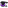
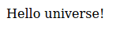

<center></center>

# Kuudere Documentation

## Table Of Contents

- [Guides](#guides)
  - [Getting started with Kuudere](#getting-started-with-kuudere)
  - [Creating your first component](#creating-your-first-component)
- [Reference](#reference)
  - [`class` Kuudere.Component\<T\>](#class-kuuderecomponentt)
  - [`class` Kuudere.JsDom](#class-kuuderejsdom)
  - [`function` Kuudere.constructComponent](#function-kuudereconstructcomponent)
  - [`namespace` Kuudere.WebScript](#namespace-kuuderewebscript)
    - [`function` Kuudere.WebScript.HTML](#namespace-kuuderewebscripthtml)
    - [`function` Kuudere.WebScript.SVG](#namespace-kuuderewebscriptsvg)

## Guides

### Getting started with Kuudere

Getting started with Kuudere doesn't even require NPM. You can simply download the latest standalone build from [here](https://github.com/K4rakara/kuudere/releases), and add `<script src="kuudere.min.js"></script>` to the head of your HTML document. From there, you can use the global `kuudere` variable to access all the functions and classes that Kuudere provides.

However, if you would like to use NPM, simply create a new project with `npm init` or `yarn init`, and then add Kuudere with `npm i kuudere` or `yarn add kuudere`.

Its recommended to use TypeScript with Kuudere, but its not a requirement.

### Creating your first component

Once you've got an environment for developing ready, you can then create a new JavaScript or TypeScript file.

Start by importing or requiring Kuudere, like so.

```ts
// For TypeScript:
import * as Kuudere from 'kuudere';
// For JavaScript:
const Kuudere = require('kuudere');
```

Once thats done, we can begin by making a new class called `MyComponent` that extends `Kuudere.Component`.

```ts
// For TypeScript:
class MyComponent extends Kuudere.Component<any> {

}
// For JavaScript:
class MyComponent extends Kuudere.Component {

}
```

We then need to make a constructor on our new class, so that we can construct the component.

```ts
// For TypeScript:
class MyComponent extends Kuudere.Component<any> {
	constructor(el: Kuudere.HTMLKuudereComponent<MyComponent>, args: Kuudere.Arguments<any>) {
		super(el, args);
	}
}
// For JavaScript:
class MyComponent extends Kuudere.Component {
	constructor(el, args) {
		super(el, args);
	}
}
```

Now, lets store the `el` argument in the Component so that we can use it outside the constructor.

```ts
// For TypeScript:
class MyComponent extends Kuudere.Component<any> {
	private el: HTMLKuudereComponent<MyComponent>;
	constructor(el: Kuudere.HTMLKuudereComponent<MyComponent>, args: Kuudere.Arguments<any>) {
		super(el, args);
		this.el = el;
	}
}
// For JavaScript:
class MyComponent extends Kuudere.Component {
	constructor(el, args) {
		super(el, args);
		this.el = el;
	}
}
```

Lets assume we pass a `string` as the `args.constructor` value, and use it to display a message.

```ts
// For TypeScript:
class MyComponent extends Kuudere.Component<string> {
	private el: HTMLKuudereComponent<MyComponent>;
	constructor(el: Kuudere.HTMLKuudereComponent<MyComponent>, args: Kuudere.Arguments<string>) {
		super(el, args);
		this.el = el;
		this.el.innerHTML += `Hello ${args.constructor}!`;
	}
}
// For JavaScript:
class MyComponent extends Kuudere.Component {
	constructor(el, args) {
		super(el, args);
		this.el = el;
		this.el.innerHTML += `Hello ${args.constructor}!`;
	}
}
```

Alright, lets try constructing the component and see how it looks!

```js
document.body.appendChild(
	Kuudere.constructComponent(
		'div',
		MyComponent,
		{ constructor: 'world' },
	)
);
```

You should get something like this:


Finally, lets add a method onto our new component.

```ts
// For TypeScript:
class MyComponent extends Kuudere.Component<string> {
	private el: HTMLKuudereComponent<MyComponent>;
	public setTarget(v: string): void {
		this.el.innerHTML = `Hello ${v}!`;
	}
	constructor(el: Kuudere.HTMLKuudereComponent<MyComponent>, args: Kuudere.Arguments<string>) {
		super(el, args);
		this.el = el;
		this.el.innerHTML += `Hello ${args.constructor}!`;
	}
}
// For JavaScript:
class MyComponent extends Kuudere.Component {
	setTarget(v) {
		this.el.innerHTML = `Hello ${v}!`;
	}
	constructor(el, args) {
		super(el, args);
		this.el = el;
		this.el.innerHTML += `Hello ${args.constructor}!`;
	}
}
```

Now, lets call the new method:

```js
const myComponentElement = document.body.appendChild(
	Kuudere.constructComponent(
		'div',
		MyComponent,
		{ constructor: 'world' },
	)
);
setTimeout(() => {
	myComponentElement.__props.setTarget('universe');
}, 5000);
```

You should see the component change to this after 5 seconds:



And thats it! you've made your first Kuudere component.

## Reference

### `class` Kuudere.Component&lt;T&gt;

#### Description

The `Kuudere.Component<T>` class allows for creating stateful HTML elements. By using the [`Kuudere.constructComponent`](#function-kuudereconstructcomponent) method, you can create HTML elements that have an additional `__props` property, in which the `this` value of your `Kuudere.Component<T>` is stored.

#### Syntax

###### JavaScript

```js
import * as Kuudere from 'kuudere';

class MyComponent extends Kuudere.Component {
	constructor(el, args) {
		super(el, args);

		// ...
	}
}
```

###### TypeScript

```ts
import * as Kuudere from 'kuudere';

class MyComponent extends Kuudere.Component<any> {
	constructor(el: Kuudere.HTMLKuudereComponent<MyComponent>, args: Kuudere.Arguments<any>) {
		super(el, args);

		// ...
	}
}
```

#### In Depth Example

###### JavaScript

```js
import * as Kuudere from 'kuudere';

class MyComponent extends Kuudere.Component {
	myMethod() {
		console.log('The quick brown fox jumps over the lazy dog');
	}
	
	constructor(el, args) {
		super(el, args);

		let element = el;
		let foo = args.constructor.foo;

		Object.defineProperty(this, 'foo', {
			get() { return foo; }
			set(v) { el.querySelector('.foo').innerHTML = v; foo = v; }
		});

		const { div } = Kuudere.WebScript.HTML();

		el.appendChild(div.class`foo`(args.constructor.foo));
	}
}

const myConstructedComponent = Kuudere.constructComponent('div', MyComponent, {
	constructor: {
		foo: 'Hello world!',
	}
});

console.log(myConstructedComponent.__props.foo); // Logs "Hello world!".

myConstructedComponent.__props.myMethod(); // Logs "The quick brown fox jumps over the lazy dog".
myConstructedComponent.__props.foo = 'Hello universe!'; // myConstructedComponent now has an innerHTML of "Hello universe!".
```

###### TypeScript
```ts
import * as Kuudere from 'kuudere';

interface MyComponentConstructor {
	foo: string;
}

class MyComponent extends Kuudere.Component<MyComponentConstructor> {
	
	#element: Kuudere.HTMLKuudereComponent<MyComponent>;

	#foo: string;
	 
	public get foo(): string { return this.#foo; }
	public set foo(v: string) {
		this.#element.querySelector('.foo')!.innerHTML = v;
		this.#foo = v;
	}
	
	public myMethod(): void {
		console.log('The quick brown fox jumps over the lazy dog');
	}
	
	constructor(el: Kuudere.HTMLKuudereComponent<MyComponent>, args: Kuudere.Arguments<MyComponentConstructor>) {
		super(el, args);

		this.#element = el;
		this.#foo = args.constructor.foo;

		const { div } = Kuudere.WebScript.HTML();

		el.appendChild(div.class`foo`(args.constructor.foo));
	}

}

const myConstructedComponent = Kuudere.constructComponent('div', MyComponent, {
	constructor: {
		foo: 'Hello world!',
	}
});

console.log(myConstructedComponent.__props.foo); // Logs "Hello world!".

myConstructedComponent.__props.myMethod(); // Logs "The quick brown fox jumps over the lazy dog".
myConstructedComponent.__props.foo = 'Hello universe!'; // myConstructedComponent now has an innerHTML of "Hello universe!".
```

### `class` Kuudere.JsDom

#### Description

`Kuudere.JsDom` is a class-based abstraction around creating DOM elements in JavaScript. It supports an [`xml2js`](https://www.npmjs.com/package/xml2js)-like syntax.

When calling `new Kuudere.JsDom(...)`, you supply an array of objects and/or strings. These objects should contain a key of `''`, which represents the tag name, at the very least. The objects may additionally contain a `$` key, which accepts key/value pairs that represent HTML attributes, as well as a `...` key, which accepts an array of more of the aforementioned objects and/or strings. Finally, the objects may also accept a `_` key, with two child keys, `listeners` and `style`. 

`listeners` accepts keys that match the names of JavaScript event listeners, with values of either functions for said event listener, or an array of functions for said event listener. `style` accepts key/value pairs that match the keys of `HTMLElement.style`.

#### Methods

###### JsDom.prototype.appendTo

Appends this `JsDom` object as an `Element` onto an `Element`.

###### JsDom.prototype.toHTML

Returns this `JsDom` object as HTML text. Note that this destroys any listeners and other JavaScript values.

###### JsDom.prototype.toDom

Returns this `JsDom` object as an array of `Element`s and `string`s.

#### In Depth Example

###### JavaScript / TypeScript

```js
new Kuudere.JsDom([
	{ '': 'div', $: { 'class': 'my-app' }, '...': [
		{
			'': 'button',
			$: { 'class': 'my-button' },
			_: {
				listeners: {
					'mouseup': () => {
						alert('Heya!');
					}
					'mouseover': [
						() => {
							console.log('mouseover event 1!');
						},
						() => {
							console.log('mouseover event 2!');
						}
					]
				}
			},
			'...': [ 'Hello!' ]
		},
		{ '': 'div', $: { 'class': 'hello' }, '...': [
			{ '': 'span', '...': [ '👋' ] },
			{ '': 'span', '...': [ 'Hello world!' ] }
		] }
	] }
]).appendTo(document.body);
```

### `function` Kuudere.constructComponent

#### Description

`Kuudere.constructComponent` handles the construction of components. It returns an `HTMLElement` with one additional property: `__props`. `__props` stores the `this` value of the class passed to its `Component` argument.

#### Syntax

###### JavaScript / TypeScript

```js
Kuudere.constructComponent(TagName, Component, Arguments);
```

##### Parameters
- `TagName`<br> A string representing the name of the HTML tag to construct this `Component` within.
- `Component`<br> A class that extends `Kuudere.Component<T>`.
- `Arguments`<br> An object with the following properties:
  - `constructor`<br> A value of the type required by the `Component` parameter.
  - `element` (Optional)<br> An object containing key/value pairs to directly apply on the element. For example, one could supply the key `'onclick'` with a function for the value.
  - `listeners` (Optional)<br> An object containing keys that correspond to the names of JavaScript event listeners, and values of either functions for said event listeners or an array of functions for said event listeners.
  - `init` (Optional)<br> A function to be called when the `Component` has been fully constructed. It gets passed the constructed HTML element.

#### In Depth Example

###### JavaScript

```js
import * as Kuudere from 'kuudere';

class MyComponent extends Kuudere.Component {
	constructor(el, args) {
		super(el, args);
		el.innerHTML += `foo = ${args.constructor.foo}\n`;
		el.innerHTML += `bar = ${args.constructor.bar}\n`;
		el.innerHTML += `baz = ${args.constructor.baz}\n`;
	}
}

document.body.appendChild(
	Kuudere.constructComponent(
		'div',
		MyComponent,
		{
			constructor: {
				foo: 1,
				bar: 'two',
				baz: 9 / 3,
			},
			listeners: {
				'mouseup': (e) => 
					console.log(`Pressed button #${e.button} on MyComponent!`),
			}
		}
	)
);
```

###### TypeScript

```ts
import * as Kuudere from 'kuudere';

interface MyComponentConstructor {
	foo: number;
	bar: string;
	baz: number;
}

class MyComponent extends Kuudere.Component<MyComponentConstructor> {
	constructor(el: Kuudere.HTMLKuudereComponent<MyComponent>, args: Kuudere.Arguments<MyComponentConstructor>) {
		super(el, args);
		el.innerHTML += `foo = ${args.constructor.foo}\n`;
		el.innerHTML += `bar = ${args.constructor.bar}\n`;
		el.innerHTML += `baz = ${args.constructor.baz}\n`;
	}
}

document.body.appendChild(
	Kuudere.constructComponent(
		'div',
		MyComponent,
		{
			constructor: {
				foo: 1,
				bar: 'two',
				baz: 9 / 3,
			},
			listeners: {
				'mouseup': (e: MouseEvent): void => 
					console.log(`Pressed button #${e.button} on MyComponent!`),
			}
		}
	)
);
```

### `namespace` Kuudere.WebScript

#### Description

`Kuudere.WebScript` provides a simple and easy to use binding between WebScript and Kuudere, while adding a few features.

##### Features

Kuudere's webscript bindings currently add one additional feature to WebScript, although more features will be added in the future. 

Currently, Kuudere adds a `$listeners` property to WebScript elements which can be passed an object containing keys that correspond to the names of JavaScript event listeners, and values of either functions for said event listeners or an array of functions for said event listeners.

##### About Webscript

More about WebScript can be found on the [official WebScript docs.](https://mudgen.github.io/webscript/docs/#)

### `function` Kuudere.WebScript.HTML

#### Description

`Kuudere.WebScript.HTML` is functionally identical to `webscript.builders(webscript.createElement)`, except that it adds the Kuudere-specific `$listeners` property.

More about WebScript can be found on the [official WebScript docs.](https://mudgen.github.io/webscript/docs/#)

### `function` Kuudere.WebScript.SVG

#### Description

`Kuudere.WebScript.SVG` is functionally identical to `webscript.builders(webscript.createSvgElement)`, except that it adds the Kuudere-specific `$listeners` property.

More about WebScript can be found on the [official WebScript docs.](https://mudgen.github.io/webscript/docs/#)
